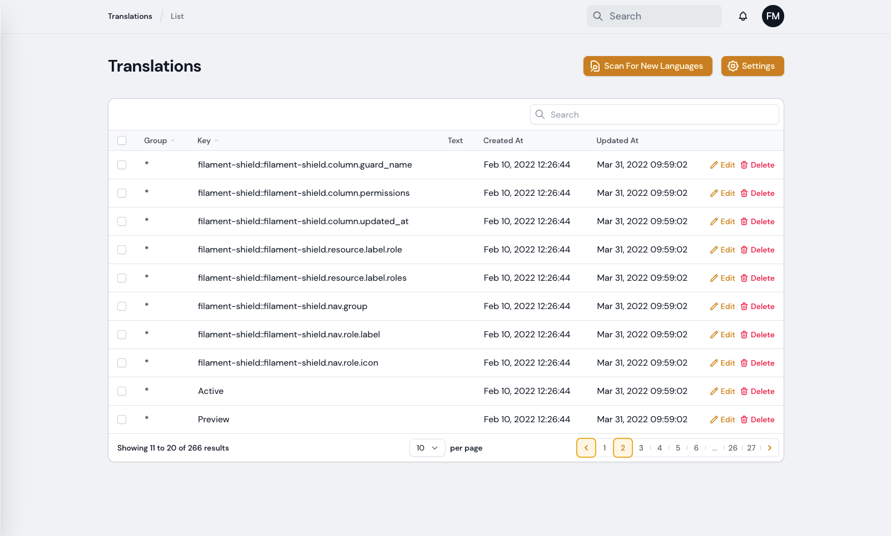
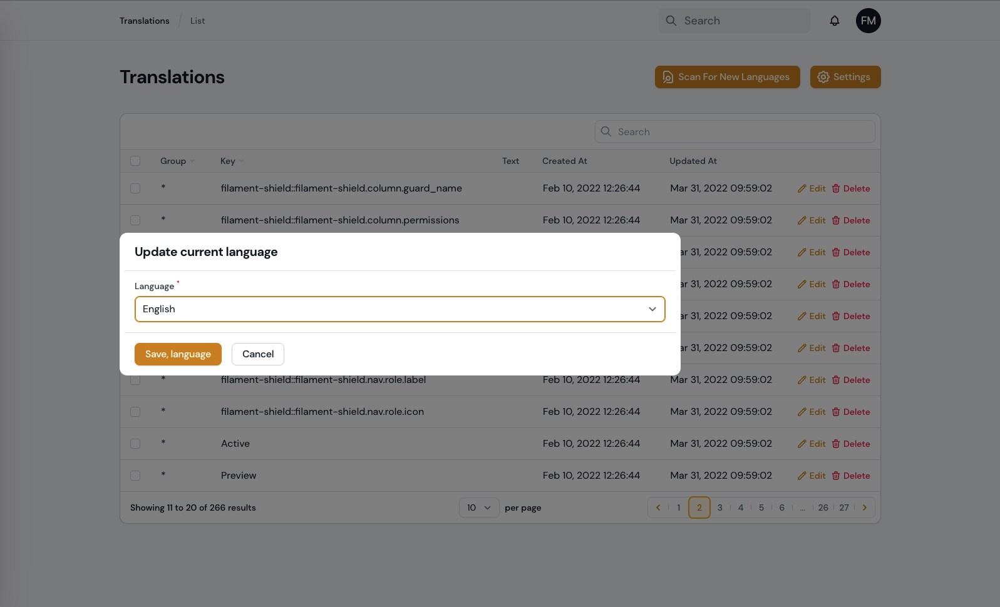
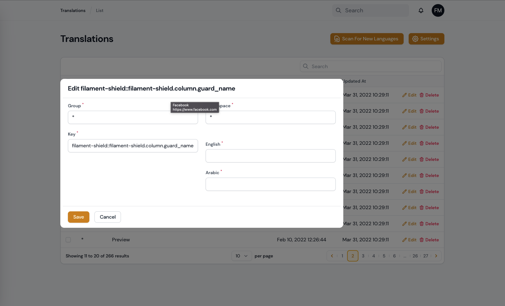

# Vilt Translations

Manage your translation with DB and cache, you can scan your languages tags like `trans()`, `__()`, and get the string inside and translate them use UI.

this plugin is build in [spatie/laravel-translation-loader](https://github.com/spatie/laravel-translation-loader)


## Screenshots






## Installation

You can install the package via composer:

```bash
composer require 3x1io/vilt-translations
```

Run migration:

```bash
php artisan vendor:publish --tag="vilt-translations"
php artisan vendor:publish --tag="vilt-translations-config"
php artisan migrate
```

In `config/app.php` (Laravel) or `bootstrap/app.php` (Lumen) you should replace Laravel's translation service provider

```php
Illuminate\Translation\TranslationServiceProvider::class,
```

by the one included in this package:

```php
Spatie\TranslationLoader\TranslationServiceProvider::class,
```

## Add Language Middleware

go to app/Http/Kernel.php and add new middleware to $middlewareGroups

```php
    'web' => [
        //...
        \io3x1\ViltTranslations\Http\Middleware\LanguageMiddleware::class,
    ],
```

and now clear cache

```bash
php artisan optimize:clear
```

## Changelog

Please see [CHANGELOG](CHANGELOG.md) for more information on what has changed recently.

## Credits

-   [3x1](https://github.com/3x1io)

## License

The MIT License (MIT). Please see [License File](LICENSE.md) for more information.
